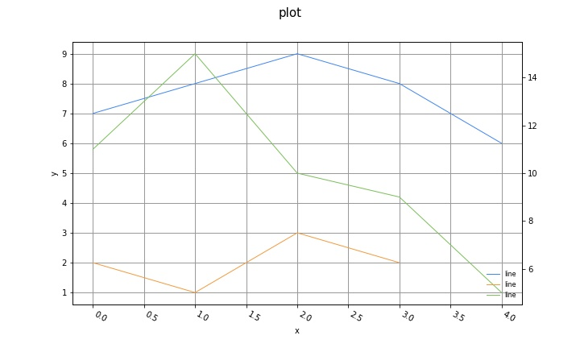

# Graphotti


This is a library for creating plots in python that is guided by the following principles:

- **Simple, intuitive, and consistent api**
    - Creating plots should be easy and fun.
    - The API should be simple, but also allow basic customization of things like the x & y axes, and grids.
    - It should be easy for you to explore your data without being bogged down by syntax and boilerplate code.
- **Easy Plot Mashability**.
    - Often times you have several separate plots that you want to combine into a single plot, eg overlaying them, or stacking them on top of each other, or next to each other. But doing so can be a hassle.
    - But it shouldn't be a hassle. It should be as easy as doing simple arithmetic to combine them.
    - It should be as easy as `a+b+c`, literally.
    - With Graphotti, arithmetic operations actually have semantic meaning for the plots.
    - Eg given plots `a`, `b` and `c`, the operation `a+b+c` overlays the plots on top of each other.
    - Other math operators will also have meaning and allow you to stack plots on top of each other, or side by side, or as a grid.
- **Plotting Library Agnostic**
    - Different plotting libraries have their advantages and disadvantages in terms of the way they display the plot.
    - Your project might require rendering the same plot to different plotting libraries, for different purposes (eg, during exploration, production, or for publication).
    - But you should not have to write completely new code from scratch to plot the exact same plot, or deal with the peculiarities of each library (and spending hours on stackoverflow).
    - With Graphotti, you can render the plot using different engines by simply setting a single parameter.
    - eg given a Graphotti plot object `p`, we can render it using matplotlib or plotly as follows:
        -  `p.plot()` to display using the default engine (matplotlib)
        -  `p.plot("mpl")` to display using matplotlib
        -  `p.plot("ply")` to display using plotly
- **Intuition Building**
    - It should be quick and easy to plot functions such as `sin` or `cos` or any other math functions easily, in order to get an intuition of what they do. Ideally it should be done by just writing a math formula in text, without having to manually create your own x and y arrays using math libraries.
    - eg: `funcplot("exp(x)/(1+exp(x))")`
    - NOTE: this feature is not implemented yet.

Read the [white paper](white_paper.md) for more information about the ambitions of this project.

## Installing and Setting up

```shell
pip install -e git+https://github.com/ronrest/graphotti.git#egg=graphotti
```

```python
import graphotti as gh
```

You can also import the following depending on whether you want to render the plots using matplotlib, or plotly.


```python
# For rendering using plotly engine within a jupyter notebook
from plotly.offline import init_notebook_mode
init_notebook_mode(connected=True)

# For rendering using matplotlib engine within a jupyter notebook
%matplotlib inline
```


## Simple Introduction for creating plots

Creating a lineplot is as simple as:

```python
a = gh.line([7,8,9,8,6])
a.plot()
```


## Combining Plots using Plot Arithmetic

### Overlaying plots

You can use the `+` and `-` operators to overlay plots on top of each other.

- `+` makes the plots share the same y axis
- `-` makes the plots on the right hand side of the operator use its own independent y axis

In the following example, three plots are created, overlayed on top of each other, and all sharing the same y axis.

```python
from plot import lineplot
a = gh.line([7,8,9,8,6])
b = gh.line([2,1,3,2])
c = gh.line([11,15,10,9,5])

overlay = a+b+c
overlay.plot()
```


In the following example, the three plots are overlayed but the final plot uses its own independent y axis.

```python
overlay = a+b-c
overlay.plot()
```



You can also overlay plots of different types, eg, below we overlay a lineplot, a step plot, and a scatterplot all on top of each other.

```python
s = gh.step(x= [1,4,5,6,7,9], y=[0,1,0,1,2,0], name="step plot")
l = gh.line(x= [0,3,6,7,8,9], y=[1,2,4,1,2,4], name="line plot")
c = gh.scatter([3,8,2,6,2,4], [4,3,3,2,1,6], labels=["a","b","c","d","e","f"], name="scatter plot")
overlayed = (l+s+c)
overlayed.plot(title="Multiple plot types overlayed")
```


## Slicing Plots

Just like you can slice lists, and arrays to get a subset of the data, you can take a slice of a plot object to get a segment of the plot. This is useful if you want to zoom in and focus on a small region of the plot.

EXAMPLE:

```python
a = gh.line([5,7,8,8,7,5,2,5,6,5,4,2,3])
b = gh.line([2,1,3,2,4,5,4,2,3,2,3,1,1,2,0])
c = gh.line([4,6,5,3,6,5,7,4,5,3,5,2,1,3,4])
overlay = a+b+c

# Unsliced plot
overlay.plot()
```


```python
# Sliced plot
overlay[6:10].plot()
```


TODO: Add example of slicing datetime indexed plots


## Y scales

NOTE: only implemented on the plotly engine so far. Not implemented on the matplotlib engine yet.

You can set eg a plot to be in log scale by setting the `scaley` property.

```python
a = gh.line([1,10,20,30,40,50,60,70,80], scaley="linear")
b = gh.line([10,20,30,40,50,60,70,80, 90], scaley="log")

# plot shown in log scale
b.plot()

# When sharing a y axis, the settings of the first plot takes precedence,
# so both show as linear
(a+b).plot()

# Here both are shown as log scale
(b+a).plot()

# If not sharing a y axis, then each plot is shown in their corresponding
# y scale setting
(a-b).plot()
```

## Saving To File

Save plots by passing a file path string to the `file` argument when calling `plot()`.

```python
overlay.plot(file="myplot.jpg")
```

## Plotting columns of a Pandas dataframe

```python
# Line plot of all the columns of a dataframe, sharing same y axes
p = gh.dfplot(df, type="line")

# Step plot of all the columns of a dataframe, with independent y axes
p = gh.dfplot(df, type="step", sharey=False)
```

## Chosing Rendering Engines

The first positional argument to the `plot()` function allows you to select which renreding engine to use to render the plot. By default, the rendering engine used is Matplotlib.

Possible values are:

- `"mpl"` Use Matplotlib
- `"plotly"` or `"ply"` Use plotly


EXAMPLES:

```python
# Plot using matplotlib explicitly
overlay.plot("mpl")

# Save as an image using matplotlib explicitly
overlay.plot("mpl", file="myplot.jpg")

# Plot using Plotly
overlay.plot("ply")

# Save as an interactive HTML plot using Plotly
overlay.plot("ply", file="myplot.html")
```


## Contributing

See the [contributing.md](contributing.md) file for details on how to contribute to this project.
