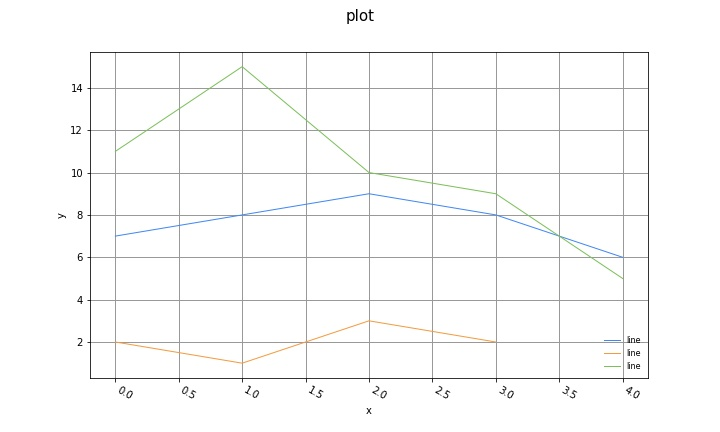

# Graphotti

This is a library for creating plots in python that is guided by the following principles:

- **Simple, intuitive, and consistent api**
    - Creating plots should have an easy api that also allow very simple customization of the x,y axes and grids.
- **Easy Plot Mashability**.
    - Often times you have several separate plots that you want to combine into a single plot, eg overlaying them, or stacking them on top of each other, or next to each other. But doing so can be a hassle.
    - But it shouldnt be a hassle. It should be as easy as doing simple arithmetic to combine them.
    - It should be as easy as `a+b+c`, literally. One of the aims of this library is to make this arithmetic syntax have meaning for the plots, and combine them in different ways depending on the mathematical operator used.
- **Plotting Library Agnostic**
    - whether you plan on rendering the plots in matplotlib, plotly, or some other python plotting library, you should not have to write completely new code from scratch. Switch between different plotting libraries as easily as changing a single vairable value.
    - eg: `p1.plot(engine="mpl")` to plot in matplotlib and then using the same plot object to plot in plotly by using `p1.plot(engine="plotly")`
- **Explorability**
    - It should be easy for you to explore your data without being bogged down by syntax and boilerplate code.
- **Intuition Building**
    - It should be quick and easy to plot functions such as `sin` or `cos` or any other math functions easily, in order to get an intuition of what they do. Ideally it should be done by just writing a math formula in text, without having to manually create your own x and y arrays using math libraries.
    - eg: `funcplot("exp(x)/(1+exp(x))")`

Read the [white paper](white_paper.md) for more information about the ambitions of this project.

## Installing and Setting up

TODO

## Simple Introduction for creating plots

Creating a lineplot is as simple as:

```py
a = lineplot([7,8,9,8,6])
a.plot()
```


## Combining Plots using Plot Arithmetic

You can use the `+` and `-` operators to overlay plots on top of each other.

- `+` makes the plots share the same y axis
- `-` makes the plots on the right hand side of the operator use its own independent y axis

In the following example, three plots are created, overlayed on top of each other, and all sharing the same y axis.

```py
from plot import lineplot
a = lineplot([7,8,9,8,6])
b = lineplot([2,1,3,2])
c= lineplot([11,15,10,9,5])

overlay = a+b+c
overlay.plot()
```



In the following example, the three plots are overlayed but the final plot uses its own independent y axis.

```py
overlay = a+b-c
overlay.plot()
```


## Saving To File

Save plots by passing a file path string to the `file` argument when calling `plot()`.

```py
overlay.plot(file="myplot.jpg")
```


## Chosing Rendering Engines

The first positional argument to the `plot()` function allows you to select which renreding engine to use to render the plot. By default, the rendering engine used is Matplotlib.

Possible values are:

- `"mpl"` Use Matplotlib
- `"plotly"` or `"ply"` Use plotly


EXAMPLES:

```py
# Plot using matplotlib explicitly
overlay.plot("mpl")

# Save as an image using matplotlib explicitly
overlay.plot("mpl", file="myplot.jpg")

# Plot using Plotly
overlay.plot("ply")

# Save as an interactive HTML plot using Plotly
overlay.plot("ply", file="myplot.html")
```


## Contributing

See the [contributing.md](contributing.md) file for details on how to contribute to this project.
